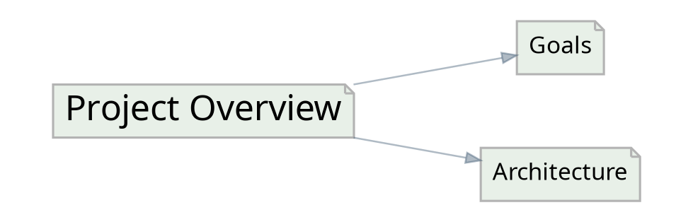

[IWE Query Language Specification](./SPEC.md)

# How to Use in Command Line

IWE provides a powerful command-line interface for managing markdown-based knowledge graphs. The CLI enables you to initialize projects, normalize documents, explore connections, export visualizations, and create consolidated documents.

## Quick Start

1.  **Initialize a project**: `iwe init`
2.  **Create a new document**: `iwe new "My Note"`
3.  **Retrieve a document with context**: `iwe retrieve -k my-note`
4.  **Find and search documents**: `iwe find "search term"`
5.  **Count matching documents**: `iwe count --filter 'status: draft'`
6.  **Normalize all documents**: `iwe normalize`
7.  **View document hierarchy**: `iwe tree`
8.  **Analyze your knowledge base**: `iwe stats`
9.  **Export graph visualization**: `iwe export -f dot`
10. **Rename a document**: `iwe rename old-key new-key`
11. **Delete a document**: `iwe delete document-key`
12. **Bulk delete by filter**: `iwe delete --filter 'status: archived'`
13. **Extract a section**: `iwe extract document --section "Title"`
14. **Inline a reference**: `iwe inline document --reference "other-doc"`
15. **Overwrite a document body**: `iwe update -k document-key -c "new content"`
16. **Mutate frontmatter**: `iwe update --filter 'status: draft' --set reviewed=true`
17. **Attach via configured action**: `iwe attach --to today -k document-key`

## Installation & Setup

Before using the CLI, ensure IWE is installed and available in your PATH. Initialize any directory as an IWE project:

```bash
cd your-notes-directory
iwe init
```

This creates a `.iwe/` directory with configuration files.

## Global Usage

```bash
iwe [OPTIONS] <COMMAND>
```

### Global Options

- `-V`, `--version`: Display version information
- `-v`, `--verbose <LEVEL>`: Set verbosity level (default: 0)
  - `1`: Minimal output (INFO level messages to stderr)
  - `2` or higher: Debug-level information to stderr
- `-h`, `--help`: Show help information

## Configuration

Commands respect settings in `.iwe/config.toml`:

```toml
[library]
path = ""  # Subdirectory containing markdown files

[markdown]
normalize_headers = true
normalize_lists = true
```

## Querying

`find`, `count`, `update`, and `delete` accept the same YAML-based filter language. Read-only commands (`retrieve`, `tree`, `export`) accept the filter flags as a selector to narrow what they operate on.

The two entry points:

- `--filter "EXPR"` — inline YAML filter document.
- Structural anchor flags — `-k`, `--includes`, `--included-by`, `--references`, `--referenced-by` (all repeatable, ANDed at the top level), with optional `KEY[:DEPTH]` / `KEY[:DIST]` colon-suffix.

See the [Query Language](./docs/query-language.md) reference for the YAML syntax, operators, and examples.

## Command Categories

### Document Management

| Command     | Description                                                 | Documentation                            |
| ----------- | ----------------------------------------------------------- | ---------------------------------------- |
| `init`      | Initialize a new IWE project                                | [IWE Init](./docs/cli-init.md)           |
| `new`       | Create a new document                                       | [IWE New](./docs/cli-new.md)             |
| `update`    | Overwrite a document body, or mutate frontmatter via filter | [IWE Update](./docs/cli-update.md)       |
| `normalize` | Normalize all documents                                     | [IWE Normalize](./docs/cli-normalize.md) |

### Document Retrieval

| Command    | Description                       | Documentation                          |
| ---------- | --------------------------------- | -------------------------------------- |
| `retrieve` | Retrieve document with context    | [IWE Retrieve](./docs/cli-retrieve.md) |
| `find`     | Search and discover documents     | [IWE Find](./docs/cli-find.md)         |
| `count`    | Count documents matching a filter | [IWE Count](./docs/cli-count.md)       |
| `tree`     | Display document hierarchy        | [IWE Tree](./docs/cli-tree.md)         |

### Refactoring Operations

| Command   | Description                               | Documentation                        |
| --------- | ----------------------------------------- | ------------------------------------ |
| `rename`  | Rename a document and update references   | [IWE Rename](./docs/cli-rename.md)   |
| `delete`  | Delete a document and clean up references | [IWE Delete](./docs/cli-delete.md)   |
| `extract` | Extract a section to a new document       | [IWE Extract](./docs/cli-extract.md) |
| `inline`  | Inline a referenced document              | [IWE Inline](./docs/cli-inline.md)   |

### Analysis & Export

| Command  | Description                          | Documentation                      |
| -------- | ------------------------------------ | ---------------------------------- |
| `schema` | Infer and display frontmatter schema | [IWE Schema](./docs/cli-schema.md) |
| `stats`  | Analyze knowledge base statistics    | [IWE Stats](./docs/cli-stats.md)   |
| `export` | Export graph visualization           | [IWE Export](./docs/cli-export.md) |
| `squash` | Squash documents                     | [IWE Squash](./docs/cli-squash.md) |

## Exit Codes

| Code | Meaning                                                    |
| ---- | ---------------------------------------------------------- |
| `0`  | Success - command completed without errors                 |
| `1`  | Error - invalid arguments, missing files, operation failed |

All commands return exit code `0` on success. On error, commands print a message to stderr and return exit code `1`.

```bash
# Check exit code
iwe find "nonexistent-query"
echo $?  # Returns 0 (empty result is not an error)

iwe retrieve --key "missing-doc"
echo $?  # Returns 1 (document not found is an error)
```

# IWE Attach

Attach a document as a block reference under one or more configured **attach actions**.

## Usage

```bash
iwe attach --list
iwe attach --to <NAME> [--to <NAME> ...] -k <KEY>
```

## Options

| Flag              | Description                                                             | Default                          |
| ----------------- | ----------------------------------------------------------------------- | -------------------------------- |
| `--to <NAME>`     | Configured attach action to attach to. Repeatable for multiple targets. | (required when not in list mode) |
| `-k, --key <KEY>` | Source document key to attach                                           | (required when not in list mode) |
| `--list`          | List configured attach actions and the resolved target keys, then exit  | false                            |
| `--dry-run`       | Preview without writing                                                 | false                            |
| `--quiet`         | Suppress progress output                                                | false                            |

## How it works

For each `--to <NAME>`:

1. Look up `<NAME>` in `[actions]` of `.iwe/config.toml`. The action must be of type `attach`.
2. Render the action's `key_template` to compute the target document key (e.g. `daily/{{today}}` becomes `daily/2026-04-25`).
3. If the target document doesn't exist yet, it is created with the action's `title` as the H1 and the new block reference as the body.
4. If the target exists, the new block reference is appended.
5. If the source is **already attached** in the target, that target is silently skipped — no error, no warning, no duplicate write.

The reference text on the new block is the source document's title.

## Configuration

Define an attach action in `.iwe/config.toml`:

```toml
[actions.today]
type = "attach"
title = "{{today}}"
key_template = "daily/{{today}}"
```

## Examples

```bash
# Discover available attach actions
iwe attach --list

# Attach a document under one configured target
iwe attach --to today -k meetings/standup

# Attach the same document under multiple targets at once
iwe attach --to today --to weekly -k meetings/standup

# Preview without writing
iwe attach --to today --to weekly -k meetings/standup --dry-run
```

## Relationship to MCP

This command mirrors the `iwe_attach` MCP tool. The MCP tool's `to` field accepts an array of action names with the same semantics.

# IWE Count

Count documents in your knowledge base that match a filter. Output is a single integer on stdout.

## Usage

```bash
iwe count [OPTIONS]
```

## Options

| Flag                           | Description                                                                             | Default |
| ------------------------------ | --------------------------------------------------------------------------------------- | ------- |
| `--filter <EXPR>`              | Inline YAML filter expression. See [Query Language](./docs/query-language.md).          | none    |
| `-k, --key <KEY>`              | Match by document key. Repeatable: 1 key uses `$eq`, 2+ uses `$in`.                     | none    |
| `--includes <KEY[:DEPTH]>`     | `$includes` anchor. Repeatable; anchors are ANDed. DEPTH defaults to `--max-depth`.     | none    |
| `--included-by <KEY[:DEPTH]>`  | `$includedBy` anchor. Repeatable; anchors are ANDed.                                    | none    |
| `--references <KEY[:DIST]>`    | `$references` anchor. Repeatable; anchors are ANDed. DIST defaults to `--max-distance`. | none    |
| `--referenced-by <KEY[:DIST]>` | `$referencedBy` anchor. Repeatable; anchors are ANDed.                                  | none    |
| `--max-depth <N>`              | Session default for inclusion anchor flags without a colon-suffix. `0` = unbounded.     | 1       |
| `--max-distance <N>`           | Session default for reference anchor flags without a colon-suffix. `0` = unbounded.     | 1       |
| `--sort <field:DIR>`           | Sort by frontmatter field before applying `--limit`. `DIR` is `1` (asc) or `-1` (desc). | none    |
| `-l, --limit <N>`              | Cap the number of matches counted (`0` = unlimited).                                    | none    |

`count` does not accept `-f / --format` or `--project`. Output is always a single integer terminated by a newline.

## How it works

`count` runs the same filter pipeline as [`iwe find`](./docs/cli-find.md) but returns just the integer count of matched documents. All filter flags AND together at the top level; combine with `--filter '$or: [...]'` for OR composition. The `KEY[:DEPTH]` / `KEY[:DIST]` colon-suffix on an anchor flag overrides the session default for that anchor only; `0` is the unbounded sentinel.

## Examples

```bash
# Total documents
iwe count

# Drafts
iwe count --filter 'status: draft'

# Drafts with a high priority
iwe count --filter '{status: draft, priority: { $gt: 3 }}'

# Descendants of an anchor, within 10 levels
iwe count --included-by projects/alpha:10

# Every descendant of an anchor (unbounded)
iwe count --included-by projects/alpha:0

# Multi-key match
iwe count -k projects/alpha -k projects/beta

# OR-composition via --filter
iwe count --filter '$or: [{ status: draft }, { status: review }]'

# Cap the count for very large corpuses
iwe count --filter 'tags: rust' -l 1000
```

## Use cases

### Quick health checks

```bash
# Are there still drafts in the queue?
iwe count --filter 'status: draft'

# Has the archive grown beyond a threshold?
iwe count --filter 'status: archived'
```

### Exit-code-friendly assertions in CI

```bash
# Fail CI if any draft remains
test "$(iwe count --filter 'status: draft')" -eq 0
```

### Coverage of a structural set

```bash
# How many documents are below this hub?
iwe count --included-by projects/alpha:0
```

## Related

- [Query Language](./docs/query-language.md) — the YAML filter syntax.
- [`iwe find`](./docs/cli-find.md) — same filter shape, returns the matched documents.
- [`iwe update`](./docs/cli-update.md) — apply mutations to the same matched set.
- [`iwe delete`](./docs/cli-delete.md) — remove the same matched set.

# IWE Delete

Delete one or many documents and clean up references to them across the knowledge base.

## Usage

```bash
iwe delete <KEY> [OPTIONS]
iwe delete --filter "EXPR" [OPTIONS]
iwe delete <KEY> --filter "EXPR" [OPTIONS]
```

Either a positional `KEY` or `--filter` is required. When both are given, the union is deleted.

## Arguments

| Argument | Description                                              |
| -------- | -------------------------------------------------------- |
| `<KEY>`  | Document key to delete (sugar for `--filter '$key: K'`). |

## Options

| Flag                 | Description                                                                      | Default    |
| -------------------- | -------------------------------------------------------------------------------- | ---------- |
| `--filter <EXPR>`    | Inline YAML filter expression. See [Query Language](./docs/query-language.md).   | none       |
| `--dry-run`          | Preview changes without writing to disk.                                         | false      |
| `--quiet`            | Suppress progress output.                                                        | false      |
| `-f, --format <FMT>` | Output format: `markdown` or `keys`. `keys` prints affected keys (one per line). | `markdown` |

`delete` does not prompt before writing. Use `--dry-run` to preview the matched set before applying.

## How it works

1. **Resolve the target set** — positional `KEY` and `--filter` matches are unioned, deduplicated, and sorted.
2. **Delete the document files** — every target is removed from the filesystem.
3. **Remove inclusion links** — [Inclusion Links](./docs/inclusion-links.md) pointing at any deleted document are dropped.
4. **Convert inline references** — inline links to deleted documents become plain text (link text is preserved).
5. **Maintain integrity** — the operation runs once across the whole matched set; no broken references remain after.

The reference cleanup step runs once over the union of targets, not per document. Documents that reference each other are handled correctly even when both are in the matched set.

## Reference cleanup

### Inclusion Links

Before:

```markdown
# Index

[Overview](overview)

[Deleted Topic](deleted-topic)

[Other Topic](other-topic)
```

After deleting `deleted-topic`:

```markdown
# Index

[Overview](overview)

[Other Topic](other-topic)
```

### Inline Links

Before:

```markdown
For more details, see [Deleted Topic](deleted-topic) and [Other](other).
```

After deleting `deleted-topic`:

```markdown
For more details, see Deleted Topic and [Other](other).
```

## Output modes

### Default (`-f markdown`)

Shows progress as documents are deleted:

```bash
$ iwe delete my-document
Deleting 'my-document'
Updated 2 document(s)
```

### Dry run (`--dry-run`)

Preview without writing:

```bash
$ iwe delete my-document --dry-run
Would delete 'my-document'
Would update 2 document(s)
  index
  overview
```

### Keys (`-f keys`)

Print affected document keys (the deleted target plus every doc whose references were rewritten):

```bash
$ iwe delete my-document -f keys
my-document
index
overview
```

Suitable for scripting. `--dry-run` combines with `-f keys` to preview affected keys.

### Quiet (`--quiet`)

Suppress all non-error output:

```bash
$ iwe delete my-document --quiet
```

## Examples

```bash
# Single doc
iwe delete old-notes

# Preview first
iwe delete obsolete-doc --dry-run

# Bulk delete by filter
iwe delete --filter 'status: archived'

# Bulk delete with preview
iwe delete --filter 'status: archived' --dry-run

# Delete every descendant of a hub (unbounded)
iwe delete --filter '$includedBy: { match: { $key: archive/2024 } }'

# Affected keys for downstream processing
iwe delete my-doc -f keys --dry-run
```

## Use cases

### Cleaning up obsolete documents

```bash
# Check what would be affected
iwe delete old-feature --dry-run

# Delete if satisfied
iwe delete old-feature
```

### Bulk archival cleanup

Use a filter to match many documents at once:

```bash
# Archive everything under a hub, then verify
iwe delete --filter 'status: archived' --dry-run -f keys > affected.txt
iwe delete --filter 'status: archived' --quiet
```

### Pipeline integration

Pair with [`iwe find`](./docs/cli-find.md) for ad-hoc selections:

```bash
iwe find temp -f keys | while read key; do
  iwe delete "$key" --quiet
done
```

For a single-pass equivalent, prefer `--filter`:

```bash
iwe delete --filter '$key: { $in: [a, b, c] }'
```

## Deprecated aliases

| Deprecated | Use instead                                                 |
| ---------- | ----------------------------------------------------------- |
| `--keys`   | `-f keys` (equivalent; `--keys` is still accepted silently) |

## Error handling

The command fails (exit code 1) when:

- Neither a positional `KEY` nor `--filter` is provided.
- The `--filter` expression cannot be parsed.
- A target document does not exist.
- Filesystem permissions prevent writing.

## Technical notes

- The operation is atomic over the full matched set — either every change succeeds or none are applied.
- Inclusion links to deleted documents are removed entirely; inline references are converted to plain text (link text preserved).
- `--dry-run` prints the would-be changes and exits without touching disk.

## Related

- [Query Language](./docs/query-language.md) — filter syntax.
- [`iwe find`](./docs/cli-find.md) — preview which documents a filter selects.
- [`iwe count`](./docs/cli-count.md) — count the matched set before deleting.

# IWE Export

Exports graph structure in various formats for visualization and analysis.

## Usage

```bash
iwe export -f <FORMAT> [OPTIONS]
```

## Available Formats

| Format | Description                                 |
| ------ | ------------------------------------------- |
| `dot`  | Graphviz DOT format for graph visualization |

## Options

| Option                         | Default   | Description                                                                         |
| ------------------------------ | --------- | ----------------------------------------------------------------------------------- |
| `-f, --format <FORMAT>`        | `dot`     | Output format. Currently `dot` only.                                                |
| `-d, --depth <DEPTH>`          | `0`       | Maximum depth to include (0 = unlimited).                                           |
| `--include-headers`            | false     | Include section headers and create detailed subgraphs.                              |
| `--filter <EXPR>`              | -         | Inline YAML filter expression. See [Query Language](./docs/query-language.md).      |
| `-k, --key <KEY>`              | all roots | Filter to specific document(s). Repeatable; 1 key = `$eq`, 2+ = `$in`.              |
| `--includes <KEY[:DEPTH]>`     | -         | `$includes` anchor. Repeatable; anchors are ANDed.                                  |
| `--included-by <KEY[:DEPTH]>`  | -         | `$includedBy` anchor. Repeatable; anchors are ANDed.                                |
| `--references <KEY[:DIST]>`    | -         | `$references` anchor. Repeatable; anchors are ANDed.                                |
| `--referenced-by <KEY[:DIST]>` | -         | `$referencedBy` anchor. Repeatable; anchors are ANDed.                              |
| `--max-depth <N>`              | `1`       | Session default for inclusion anchor flags without a colon-suffix. `0` = unbounded. |
| `--max-distance <N>`           | `1`       | Session default for reference anchor flags without a colon-suffix. `0` = unbounded. |
| `-v, --verbose <LEVEL>`        | `0`       | Verbosity level.                                                                    |

> **Breaking change:** in earlier versions, `iwe export <FORMAT>` accepted the format as a positional argument. The format is now the `-f / --format` flag with a default of `dot`. The previous `iwe export dot` becomes `iwe export -f dot` (or simply `iwe export`).

## DOT Output Format

The DOT format produces Graphviz-compatible output:



Nodes represent documents, edges represent links between them.

## Examples

```bash
# Export entire graph
iwe export

# Export specific document and connections
iwe export --key project-main

# Include section headers for detailed view
iwe export --include-headers

# Export with depth limit
iwe export --key research --depth 3

# Export with headers and depth limit
iwe export --key research --depth 3 --include-headers

# Restrict to documents under a hub (unbounded)
iwe export --included-by projects/alpha:0

# Restrict by frontmatter
iwe export --filter 'status: active'
```

## Generating Images

```bash
# Generate PNG visualization
iwe export > graph.dot
dot -Tpng graph.dot -o graph.png

# Generate SVG for web use
iwe export --include-headers > detailed.dot
dot -Tsvg detailed.dot -o detailed.svg

# Direct to PNG (one-liner)
iwe export | dot -Tpng -o graph.png

# Interactive visualization in browser
iwe export | dot -Tsvg > graph.svg && open graph.svg
```

## Depth Behavior

| Depth | Behavior                                    |
| ----- | ------------------------------------------- |
| `0`   | Unlimited - include all reachable documents |
| `1`   | Only the specified document                 |
| `2`   | Document and its direct links               |
| `3+`  | Document and N-1 levels of connections      |

## With vs Without Headers

| Mode                        | Use Case                                |
| --------------------------- | --------------------------------------- |
| Without `--include-headers` | High-level document relationships       |
| With `--include-headers`    | Detailed view showing internal sections |

## AI Agent Tips

- Use `export` to analyze document relationship topology
- Generate visualizations to identify disconnected clusters
- Use `--depth` to focus on specific neighborhoods in large graphs
- Combine with `--key`, `--included-by`, or `--filter` to visualize a single topic and its context
- The graph structure reveals how knowledge is organized and connected

## Deprecated aliases

The following flags pre-date the query language and remain accepted for backward compatibility. Each invocation prints a one-line `warning: ... is deprecated` to stderr.

| Deprecated        | Use instead                                                                     |
| ----------------- | ------------------------------------------------------------------------------- |
| `--in KEY[:N]`    | `--included-by KEY[:N]`                                                         |
| `--in-any K1 K2`  | `--filter '$or: [{ $includedBy: K1 }, { $includedBy: K2 }]'`                    |
| `--not-in KEY`    | `--filter '$nor: [{ $includedBy: KEY }]'`                                       |
| `--refs-to KEY`   | `--references KEY` (legacy semantics: ORs `$includes` and `$references`)        |
| `--refs-from KEY` | `--referenced-by KEY` (legacy semantics: ORs `$includedBy` and `$referencedBy`) |

# IWE Extract

Extract a section from a document into a new document with an [Inclusion Links](./docs/inclusion-links.md).

## Usage

```bash
iwe extract <KEY> [OPTIONS]
```

## Arguments

| Argument | Description                                    |
| -------- | ---------------------------------------------- |
| `<KEY>`  | Document key containing the section to extract |

## Options

| Flag                | Description                                   |
| ------------------- | --------------------------------------------- |
| `--section <TITLE>` | Section title to extract (case-insensitive)   |
| `--block <N>`       | Block number to extract (1-indexed)           |
| `--list`            | List all sections with block numbers          |
| `--action <NAME>`   | Action name from config to use for extraction |
| `--dry-run`         | Preview changes without writing to disk       |
| `--quiet`           | Suppress progress output                      |
| `--keys`            | Print affected document keys (one per line)   |

## How It Works

The `extract` command creates a new document from an existing section:

1.  **Select a section** - Use `--list` to see available sections, then select with `--section` or `--block`
2.  **Create new document** - The section content is moved to a new document
3.  **Add inclusion link** - The original section is replaced with a link to the new document
4.  **Adjust headers** - Header levels are adjusted to maintain proper document structure

## Workflow

### Step 1: List Available Sections

```bash
$ iwe extract my-document --list
1: Introduction
2: Getting Started
3: Configuration
4: Advanced Topics
```

### Step 2: Extract by Title or Block Number

```bash
# By title (case-insensitive, partial match)
$ iwe extract my-document --section "configuration"
Extracting section 'Configuration' to 'configuration'
Done

# By block number (unambiguous)
$ iwe extract my-document --block 3
Extracting section 'Configuration' to 'configuration'
Done
```

## Configuration

The `--action` flag uses extraction settings from `.iwe/config.toml`:

```toml
[actions]
extract = { type = "extract", title = "Extract", key_template = "{{slug}}", link_type = "markdown" }
```

Without `--action`, the command uses the first `extract` action found in config, or defaults to:

- `key_template = "{{slug}}"` - URL-friendly version of the section title
- `link_type = "markdown"` - Standard markdown links

### Key Template Variables

See [feature-extract.md](./docs/feature-extract.md#template-variables.md) for all available template variables.

## Output Modes

### Default Output

Shows progress:

```bash
$ iwe extract my-document --section "Architecture"
Extracting section 'Architecture' to 'architecture'
Done
```

### Dry Run (`--dry-run`)

Preview what would happen:

```bash
$ iwe extract my-document --section "Design" --dry-run
Would extract section 'Design' to 'design'
Would update 'my-document'
```

### Keys Output (`--keys`)

Print affected document keys:

```bash
$ iwe extract my-document --block 2 --keys
my-document
getting-started
```

## Examples

```bash
# List all sections with block numbers
iwe extract notes/project --list

# Extract section by title
iwe extract notes/project --section "Architecture"

# Extract section by block number (unambiguous)
iwe extract notes/project --block 2

# Preview changes without writing
iwe extract notes/project --section "Notes" --dry-run

# Use a specific action from config
iwe extract notes/project --section "Design" --action "my-extract"

# Get keys for scripting
iwe extract notes/project --section "API" --keys
```

## Use Cases

### Breaking Down Large Documents

Extract sections to create a modular document structure:

```bash
# See what sections exist
iwe extract large-document --list

# Extract each major section
iwe extract large-document --section "Introduction"
iwe extract large-document --section "Implementation"
iwe extract large-document --section "Testing"
```

### Organizing by Topic

Move related content to dedicated documents:

```bash
# Preview the extraction
iwe extract project-notes --section "Authentication" --dry-run

# Extract to a dedicated document
iwe extract project-notes --section "Authentication"
```

### Scripting

Use with other commands:

```bash
# Extract and get the new document key
NEW_KEY=$(iwe extract doc --section "API" --keys | tail -1)
echo "Created: $NEW_KEY"
```

## Error Handling

The command fails with an error if:

- The document does not exist
- No section matches the provided title (with `--section`)
- Multiple sections match the title (use `--block` instead)
- The block number is out of range (with `--block`)
- Must specify `--section`, `--block`, or `--list`

## Key Collision Handling

When the generated key already exists, IWE automatically appends numeric suffixes:

1.  First attempt: `architecture.md`
2.  If exists: `architecture-1.md`
3.  If exists: `architecture-2.md`

## Technical Notes

- Header levels are adjusted automatically (H2 in source becomes H1 in extracted document)
- The original section is replaced with an inclusion link
- The command uses the same extraction logic as the LSP code action
- Directory structure is preserved based on the source document location

# IWE Find

Search and discover documents in your knowledge base. Combines a fuzzy `QUERY` (matched against title and key) with a YAML-based filter language.

## Usage

```bash
iwe find [QUERY] [OPTIONS]
```

## Options

| Flag                           | Description                                                                         | Default    |
| ------------------------------ | ----------------------------------------------------------------------------------- | ---------- |
| `[QUERY]`                      | Fuzzy search on document title and key                                              | none       |
| `--filter <EXPR>`              | Inline YAML filter expression. See [Query Language](./docs/query-language.md).      | none       |
| `-k, --key <KEY>`              | Match by document key. Repeatable: 1 key uses `$eq`, 2+ uses `$in`.                 | none       |
| `--includes <KEY[:DEPTH]>`     | `$includes` anchor. Repeatable; anchors are ANDed.                                  | none       |
| `--included-by <KEY[:DEPTH]>`  | `$includedBy` anchor. Repeatable; anchors are ANDed.                                | none       |
| `--references <KEY[:DIST]>`    | `$references` anchor. Repeatable; anchors are ANDed.                                | none       |
| `--referenced-by <KEY[:DIST]>` | `$referencedBy` anchor. Repeatable; anchors are ANDed.                              | none       |
| `--max-depth <N>`              | Session default for inclusion anchor flags without a colon-suffix. `0` = unbounded. | 1          |
| `--max-distance <N>`           | Session default for reference anchor flags without a colon-suffix. `0` = unbounded. | 1          |
| `--project <f1,f2,...>`        | Frontmatter fields to include in JSON / YAML output (comma-separated).              | none       |
| `--sort <field:DIR>`           | Sort by frontmatter field. `DIR` is `1` (asc) or `-1` (desc).                       | none       |
| `-l, --limit <N>`              | Maximum number of results (`0` = unlimited).                                        | unlimited  |
| `-f, --format <FMT>`           | Output format: `markdown`, `keys`, `json`, `yaml`.                                  | `markdown` |

All filter clauses (positional `QUERY` plus every flag above) are AND-composed at the top level. For OR or NOT, write it inside `--filter`. See [Query Language](./docs/query-language.md).

## Filter language

`--filter` accepts a YAML mapping. Bare scalars become equality predicates; `$`-prefixed keys are operators.

```bash
# Bare equality on a frontmatter field
iwe find --filter 'status: draft'

# Multiple top-level keys are ANDed
iwe find --filter '{status: draft, priority: { $gt: 3 }}'

# OR composition
iwe find --filter '$or: [{ status: draft }, { status: review }]'

# Comparison and ordering
iwe find --filter 'priority: { $gte: 3, $lte: 7 }' --sort modified_at:-1

# Membership
iwe find --filter 'tags: rust'                                    # array membership
iwe find --filter 'status: { $in: [draft, review] }'              # any of these

# Presence
iwe find --filter 'reviewed_by: { $exists: false }'
```

See [Query Language](./docs/query-language.md) for the full operator vocabulary.

## Structural anchors

The four `$`-prefixed graph operators have CLI shortcuts. They walk inclusion edges (block-reference inclusion links) or reference edges (inline links), starting at the named anchor key.

```bash
# Direct sub-documents only — scalar shorthand fixes maxDepth: 1
iwe find --included-by projects/alpha

# Walk inclusion edges down 5 levels
iwe find --included-by projects/alpha:5

# Every descendant (unbounded — depth `0` is the unbounded sentinel)
iwe find --included-by projects/alpha:0

# Anchors are ANDed: documents under both alpha and dmytro
iwe find --included-by projects/alpha --included-by people/dmytro

# Per-anchor depth: alpha within 3 levels, dmytro direct only
iwe find --included-by projects/alpha:3 --included-by people/dmytro:1

# Session default for un-suffixed anchors
iwe find --max-depth 5 --included-by projects/alpha --included-by research/q2

# Documents that reference a specific document (inline links)
iwe find --references people/alice

# Walk reference edges within 3 hops
iwe find --referenced-by archive/index:3

# OR composition of structural anchors via --filter
iwe find --filter '$or: [{ $includedBy: projects/alpha }, { $includedBy: projects/beta }]'
```

The same selector flags are accepted by [`iwe count`](./docs/cli-count.md), [`iwe retrieve`](./docs/cli-retrieve.md), [`iwe tree`](./docs/cli-tree.md), [`iwe export`](./docs/cli-export.md), [`iwe schema`](./docs/cli-schema.md), [`iwe update`](./docs/cli-update.md), and [`iwe delete`](./docs/cli-delete.md).

## How it works

1. **Fuzzy matching** — `QUERY` is matched against both the key and the title using SkimMatcherV2.
2. **Filter** — `--filter` and the structural-anchor flags evaluate per document; results are intersected.
3. **Sort** — `--sort field:DIR` orders the matched set; ties are broken by document key.
4. **Limit** — applied last.
5. **Project** — for `json` / `yaml` output, `--project` selects which frontmatter fields appear in each result.

Without a query, results are sorted by incoming-reference popularity. With a query, they are sorted by fuzzy match score.

## Output formats

### Markdown (default)

```markdown
## Documents

Found 3 results:

- [User Authentication](authentication) (root)
- [Login Flow](login-flow) <- [User Authentication](authentication)
- [Session Management](session-management) <- [User Authentication](authentication)
```

### Keys (`-f keys`)

```
authentication
login-flow
session-management
```

One key per line; suitable for piping.

### JSON (`-f json`)

```json
[
  {
    "key": "authentication",
    "title": "User Authentication",
    "includedBy": []
  }
]
```

The top-level value is a bare array of result objects. Each object carries the system fields `key`, `title`, `includedBy`, and every user-frontmatter field merged at the top level. `includedBy` entries are `EdgeRef { key, title, sectionPath }`.

`--project title,status` projects only those fields into each result, in the listed order. System fields and user frontmatter fields are projectable interchangeably.

### YAML (`-f yaml`)

Same shape as JSON, rendered as YAML.

## Examples

```bash
# All documents, default markdown
iwe find

# Fuzzy search
iwe find authentication

# Fuzzy search AND a frontmatter filter
iwe find auth --filter 'status: draft'

# Roots — documents with no incoming inclusion edges
iwe find --filter '$nor: [{ $includedBy: { match: {} } }]'

# Limit
iwe find --limit 10

# JSON for programmatic use, project two fields
iwe find --project title,modified_at -f json

# Pipe keys to retrieve
iwe find --filter 'status: draft' -f keys | xargs -I {} iwe retrieve -k {}
```

## Deprecated aliases

The following flags pre-date the query language and remain accepted for backward compatibility. Each invocation prints a one-line `warning: ... is deprecated` to stderr.

| Deprecated        | Use instead                                                                     |
| ----------------- | ------------------------------------------------------------------------------- |
| `--in KEY[:N]`    | `--included-by KEY[:N]`                                                         |
| `--in-any K1 K2`  | `--filter '$or: [{ $includedBy: K1 }, { $includedBy: K2 }]'`                    |
| `--not-in KEY`    | `--filter '$nor: [{ $includedBy: KEY }]'`                                       |
| `--refs-to KEY`   | `--references KEY` (legacy semantics: ORs `$includes` and `$references`)        |
| `--refs-from KEY` | `--referenced-by KEY` (legacy semantics: ORs `$includedBy` and `$referencedBy`) |
| `--roots`         | `--filter '$nor: [{ $includedBy: { match: {} } }]'`                             |

## Technical notes

- All filter flags AND together at the top level. To compose with OR or NOR, wrap inside `--filter`.
- The colon-suffix on an anchor flag (`KEY:N`) overrides `--max-depth` / `--max-distance` for that anchor only. `0` is the unbounded sentinel.
- Combining `-k KEY` with a `--filter` whose top level also contains `$key` is a parse-time error. Use `-k a -k b` for multi-key match (lowers to `$key: { $in: [a, b] }`), or write the OR inside `--filter`.
- Both [Inclusion Links](./docs/inclusion-links.md) and inline references count toward `incoming_refs`.

# IWE Init

Initializes the current directory as an IWE project.

## Usage

```bash
iwe init
```

## What It Creates

Running `iwe init` creates:

```
.iwe/
└── config.toml    # Project configuration
```

The `.iwe/` directory marks the project root and stores configuration files.

## Default Configuration

The generated `config.toml` contains:

```toml
version = 3

[markdown]
refs_extension = ""
date_format = "%b %d, %Y"

[library]
path = ""
date_format = "%Y-%m-%d"

[completion]

[commands]
[commands.default]
run = "claude -p"
timeout_seconds = 120

[actions]
[actions.extract]
type = "extract"
title = "Extract"
link_type = "markdown"
key_template = "{{id}}"

[actions.inline_section]
type = "inline"
title = "Inline section"
inline_type = "section"
keep_target = false

[actions.sort]
type = "sort"
title = "Sort A-Z"
reverse = false

[templates]
[templates.default]
key_template = "{{slug}}"
document_template = "# {{title}}\n\n{{content}}"
```

## Configuration Options

### Library Section

| Option             | Default    | Description                                                   |
| ------------------ | ---------- | ------------------------------------------------------------- |
| `path`             | `""`       | Subdirectory containing markdown files (empty = project root) |
| `date_format`      | `%Y-%m-%d` | Format for dates in document keys                             |
| `default_template` | `null`     | Template name for `iwe new` command                           |

### Markdown Section

| Option           | Default     | Description                                          |
| ---------------- | ----------- | ---------------------------------------------------- |
| `refs_extension` | `""`        | File extension to append to references (e.g., `.md`) |
| `date_format`    | `%b %d, %Y` | Format for dates displayed in documents              |

### Completion Section

| Option               | Default | Description                                                                       |
| -------------------- | ------- | --------------------------------------------------------------------------------- |
| `link_format`        | `null`  | Link style for completions: `markdown` or `wiki` (overridden by a typed `[`/`[[`) |
| `min_prefix_length`  | `0`     | Characters required in the search query before completions appear                 |
| `trigger_characters` | `["["]` | Characters that open the completion popup in the editor                           |

## Example

```bash
cd ~/my-notes
iwe init
# Output: Creates .iwe/config.toml

# Verify initialization
ls -la .iwe/
# Output: config.toml
```

## Customization

After initialization, edit `.iwe/config.toml` to:

- Store markdown files in a subdirectory: set `library.path = "docs"`
- Use wiki-style links: set `completion.link_format = "wiki"`
- Change completion trigger characters: set `completion.trigger_characters = ["[", "+"]`
- Define custom templates for document creation
- Configure AI-powered actions with custom commands

## Re-initialization

Running `iwe init` in an already-initialized project is safe - it will not overwrite an existing `config.toml`.

# IWE Inline

Replace an [Inclusion Links](./docs/inclusion-links.md) with the referenced document content.

## Usage

```bash
iwe inline <KEY> [OPTIONS]
```

## Arguments

| Argument | Description                                     |
| -------- | ----------------------------------------------- |
| `<KEY>`  | Document key containing the reference to inline |

## Options

| Flag                | Description                                 |
| ------------------- | ------------------------------------------- |
| `--reference <KEY>` | Reference key or title to inline            |
| `--block <N>`       | Block number to inline (1-indexed)          |
| `--list`            | List all inclusion links with numbers       |
| `--action <NAME>`   | Action name from config to use for inlining |
| `--as-quote`        | Inline as blockquote instead of section     |
| `--keep-target`     | Keep the target document after inlining     |
| `--dry-run`         | Preview changes without writing to disk     |
| `--quiet`           | Suppress progress output                    |
| `--keys`            | Print affected document keys (one per line) |

## How It Works

The `inline` command embeds referenced content directly into the source document:

1.  **Select a reference** - Use `--list` to see available references, then select with `--reference` or `--block`
2.  **Embed content** - The referenced document's content replaces the inclusion link
3.  **Delete target** (optional) - By default, the referenced document is deleted
4.  **Clean up references** - Other references to the deleted document are updated

## Workflow

### Step 1: List Available References

```bash
$ iwe inline my-document --list
1: [Introduction](introduction)
2: [Getting Started](getting-started)
3: [Configuration](config)
```

### Step 2: Inline by Reference or Block Number

```bash
# By reference key/title (case-insensitive, partial match)
$ iwe inline my-document --reference "getting-started"
Inlining [Getting Started](getting-started) into 'my-document'
Done

# By block number (unambiguous)
$ iwe inline my-document --block 2
Inlining [Getting Started](getting-started) into 'my-document'
Done
```

## Inline Types

### Section (Default)

Embeds the full content of the referenced document:

Before:

```markdown
# My Document

[Introduction](introduction)
```

After:

```markdown
# My Document

## Introduction

Content from the introduction document...
```

### Quote (`--as-quote`)

Wraps the content in a blockquote:

Before:

```markdown
# My Document

[Quote Source](quote-source)
```

After:

```markdown
# My Document

> Content from the quote source document...
```

## Target Document Handling

### Default Behavior (Delete Target)

By default, the target document is deleted and other references are cleaned up:

```bash
$ iwe inline index --reference "old-section"
Inlining [Old Section](old-section) into 'index'
Done
```

### Keep Target (`--keep-target`)

Preserve the target document after inlining:

```bash
$ iwe inline index --reference "shared-content" --keep-target
Inlining [Shared Content](shared-content) into 'index'
Done
```

## Configuration

The `--action` flag uses inline settings from `.iwe/config.toml`:

```toml
[actions]
inline_section = { type = "inline", title = "Inline Section", inline_type = "section", keep_target = false }
inline_quote = { type = "inline", title = "Inline as Quote", inline_type = "quote", keep_target = true }
```

## Output Modes

### Default Output

Shows progress:

```bash
$ iwe inline my-document --reference "config"
Inlining [Configuration](config) into 'my-document'
Done
```

### Dry Run (`--dry-run`)

Preview what would happen:

```bash
$ iwe inline my-document --reference "config" --dry-run
Would inline [Configuration](config) into 'my-document'
Would delete 'config'
Would update 2 additional document(s)
```

### Keys Output (`--keys`)

Print affected document keys:

```bash
$ iwe inline my-document --block 1 --keys
my-document
introduction
other-referencing-doc
```

## Examples

```bash
# List all inclusion links with numbers
iwe inline notes/index --list

# Inline by reference key
iwe inline notes/index --reference "architecture"

# Inline by block number (unambiguous)
iwe inline notes/index --block 1

# Preview changes without writing
iwe inline notes/index --reference "design" --dry-run

# Keep the target document after inlining
iwe inline notes/index --block 2 --keep-target

# Inline as blockquote instead of section
iwe inline notes/index --reference "notes" --as-quote

# Use a specific action from config
iwe inline notes/index --reference "design" --action "inline_quote"
```

## Use Cases

### Consolidating Documents

Merge related documents into a single comprehensive document:

```bash
# See what references exist
iwe inline comprehensive-guide --list

# Inline each section
iwe inline comprehensive-guide --reference "intro"
iwe inline comprehensive-guide --reference "setup"
iwe inline comprehensive-guide --reference "usage"
```

### Embedding Quotes

Add cited content as blockquotes:

```bash
iwe inline article --reference "source-material" --as-quote --keep-target
```

### Preview Impact

Check what would be affected before inlining:

```bash
# See all affected documents
iwe inline index --reference "shared-doc" --dry-run

# Get keys for further analysis
iwe inline index --reference "shared-doc" --keys --dry-run
```

### Scripting

Use with other commands:

```bash
# Inline all references in a document
iwe inline my-doc --list | while read line; do
  NUM=$(echo "$line" | cut -d: -f1)
  iwe inline my-doc --block "$NUM" --quiet
done
```

## Error Handling

The command fails with an error if:

- The document does not exist
- No reference matches the provided key/title (with `--reference`)
- Multiple references match (use `--block` instead)
- The block number is out of range (with `--block`)
- Must specify `--reference`, `--block`, or `--list`

## Technical Notes

- When inlining as a section, header levels are adjusted appropriately
- When deleting the target, all other references to it are cleaned up
- Inline references (not inclusion links) are converted to plain text
- The command uses the same inline logic as the LSP code action

# IWE New

Creates a new document from a template.

## Usage

```bash
iwe new <TITLE> [OPTIONS]
```

## Arguments

- `<TITLE>`: Title for the new document (required)

## Options

- `-t, --template <NAME>`: Template name from config (default: "default")
- `-c, --content <CONTENT>`: Initial content for the document
- `-i, --if-exists <MODE>`: Behavior when file already exists (default: "suffix")
  - `suffix`: Append `-1`, `-2`, etc. to filename until unique
  - `override`: Overwrite existing file
  - `skip`: Do nothing, exit successfully without output
- `-e, --edit`: Open created file in `$EDITOR` after creation

## What it does

- Creates a new markdown file using the specified template
- Generates filename from the title (slugified)
- Supports content from command-line argument or stdin pipe
- Prints the absolute path of the created file to stdout
- Optionally opens the file in your configured editor

## Template Variables

Templates support the following variables:

- `{{title}}`: The provided title argument
- `{{slug}}`: Slugified title (kebab-case)
- `{{today}}`: Current date (uses `library.date_format` for key, `markdown.date_format` for content). Intended for date-only formatting.
- `{{now}}`: Current date/time (uses `library.time_format` for key, `markdown.time_format` for content). Falls back to `date_format` if `time_format` is not set. Supports both date specifiers (`%Y`, `%m`, `%d`) and time specifiers (`%H`, `%M`, `%S`).
- `{{id}}`: Random 8-character alphanumeric ID
- `{{content}}`: Content from `-c` option or stdin

## Examples

```bash
# Create a new note with default template
iwe new "My New Note"
# Creates: my-new-note.md (or my-new-note-1.md if exists)

# Create with content
iwe new "Meeting Notes" --content "Discussed project timeline"

# Pipe content from clipboard (macOS)
pbpaste | iwe new "Clipboard Note"

# Create and open in editor
iwe new "Quick Idea" --edit

# Use a custom template
iwe new "Daily Journal" --template journal

# Overwrite existing file
iwe new "My Note" --if-exists override

# Skip if file exists (useful in scripts)
iwe new "My Note" --if-exists skip
```

## Configuration

Templates are defined in `.iwe/config.toml`:

```toml
[library]
default_template = "default"  # Optional: set default template

[templates.default]
key_template = "{{slug}}"
document_template = "# {{title}}\n\n{{content}}"

[templates.journal]
key_template = "journal/{{today}}"
document_template = "# {{today}}\n\n{{content}}"
```

# IWE Normalize

Performs comprehensive document normalization across all markdown files in your knowledge base.

## Usage

```bash
iwe normalize
```

## Operations Performed

| Operation                | Description                                        |
| ------------------------ | -------------------------------------------------- |
| Link title sync          | Updates link text to match target document headers |
| Header leveling          | Adjusts header levels for consistent hierarchy     |
| List renumbering         | Fixes ordered list numbering (1, 2, 3...)          |
| Whitespace normalization | Standardizes newlines and indentation              |
| List formatting          | Ensures consistent list item formatting            |
| Structure cleanup        | Removes redundant empty lines                      |

## Before/After Examples

### Link Title Sync

Before:

```markdown
See the [old title](project-docs) for details.
```

After (if `project-docs.md` has header `# Project Documentation`):

```markdown
See the [Project Documentation](project-docs) for details.
```

### List Renumbering

Before:

```markdown
1. First item
1. Second item
1. Third item
```

After:

```markdown
1. First item
2. Second item
3. Third item
```

### Whitespace Normalization

Before:

```markdown
# Title

Some paragraph.

Another paragraph.
```

After:

```markdown
# Title

Some paragraph.

Another paragraph.
```

## Examples

```bash
# Basic normalization
iwe normalize

# With INFO level logging
iwe -v 1 normalize

# With DEBUG level logging
iwe -v 2 normalize
```

## Safety Warning

**Important:** The normalize command modifies files in place. Always ensure you have a backup or version control before running:

```bash
# Recommended: commit changes before normalizing
git add -A && git commit -m "Before normalization"

# Run normalization
iwe normalize

# Review changes
git diff
```

## Configuration

Normalization behavior is controlled by `.iwe/config.toml`:

```toml
[markdown]
refs_extension = ""  # Extension for reference links
```

## Idempotency

Running `normalize` multiple times produces the same result - once files are normalized, subsequent runs make no changes.

# IWE Rename

Rename a document and update all references to it across the knowledge base.

## Usage

```bash
iwe rename <OLD_KEY> <NEW_KEY> [OPTIONS]
```

## Arguments

| Argument    | Description          |
| ----------- | -------------------- |
| `<OLD_KEY>` | Current document key |
| `<NEW_KEY>` | New document key     |

## Options

| Flag        | Description                                 |
| ----------- | ------------------------------------------- |
| `--dry-run` | Preview changes without writing to disk     |
| `--quiet`   | Suppress progress output                    |
| `--keys`    | Print affected document keys (one per line) |

## How It Works

The `rename` command performs a safe document rename with full reference tracking:

1.  **Renames the document file** - Moves the document from old key to new key
2.  **Updates [Inclusion Links](./docs/inclusion-links.md)** - All inclusion links pointing to the old key are updated
3.  **Updates inline links** - All inline references to the old key are updated
4.  **Maintains integrity** - Ensures no broken references after renaming

## Output Modes

### Default Output

Shows progress and summary:

```bash
$ iwe rename old-document new-document
Renaming 'old-document' to 'new-document'
Updated 3 document(s)
```

### Dry Run (`--dry-run`)

Preview what would happen without making changes:

```bash
$ iwe rename old-document new-document --dry-run
Would rename 'old-document' to 'new-document'
Would update 3 document(s)
  index
  overview
  related-topic
```

### Keys Output (`--keys`)

Print affected document keys for scripting:

```bash
$ iwe rename old-document new-document --keys
old-document
new-document
index
overview
related-topic
```

### Quiet Mode (`--quiet`)

Suppress all output except errors:

```bash
$ iwe rename old-document new-document --quiet
```

## Examples

```bash
# Basic rename
iwe rename my-note renamed-note

# Preview changes first
iwe rename old-key new-key --dry-run

# Get affected keys for processing
iwe rename document new-document --keys

# Silent rename (for scripts)
iwe rename doc new-doc --quiet
```

## Use Cases

### Reorganizing Knowledge Base

Rename documents to follow a new naming convention:

```bash
# Check what would be affected
iwe rename user-auth authentication --dry-run

# Perform the rename
iwe rename user-auth authentication
```

### Moving to Subdirectories

Move a document into a subdirectory:

```bash
# Move from root to subdirectory
iwe rename config settings/config
```

### Scripting

Use with other commands for batch operations:

```bash
# Get list of affected documents for further processing
iwe rename old-api api-v2 --keys | while read key; do
  echo "Affected: $key"
done
```

## Error Handling

The command fails with an error if:

- The source document does not exist
- The target key already exists
- There are filesystem permission issues

## Technical Notes

- References include both inclusion links and inline links
- The operation is atomic - either all changes succeed or none are applied
- Directory structure is preserved when renaming with path components

# IWE Retrieve

Retrieves document content with graph expansion and relationship context. Designed for AI agents to navigate and understand the knowledge graph.

## Usage

```bash
iwe retrieve [OPTIONS]
```

Without `-k`, reads the document key from stdin (for piping).

## Options

| Flag                           | Description                                                                         | Default    |
| ------------------------------ | ----------------------------------------------------------------------------------- | ---------- |
| `-k, --key <KEY>`              | Document key(s) to retrieve (repeatable). 1 key = `$eq`, 2+ = `$in`.                | stdin      |
| `-e, --exclude <KEY>`          | Exclude document key(s) from results (repeatable).                                  | none       |
| `-d, --depth <N>`              | Follow children down N levels.                                                      | 1          |
| `-c, --context <N>`            | Include N levels of parent context.                                                 | 1          |
| `-l, --links`                  | Include inline referenced documents.                                                | false      |
| `-b, --backlinks`              | Include incoming references in output.                                              | true       |
| `-f, --format <FMT>`           | Output format: `markdown`, `keys`, `json`, `yaml`.                                  | `markdown` |
| `--no-content`                 | Exclude content, show child documents instead (metadata only).                      | false      |
| `--dry-run`                    | Show document count and total lines without content.                                | false      |
| `--filter <EXPR>`              | Inline YAML filter expression. See [Query Language](./docs/query-language.md).      | none       |
| `--includes <KEY[:DEPTH]>`     | `$includes` anchor. Repeatable; anchors are ANDed.                                  | none       |
| `--included-by <KEY[:DEPTH]>`  | `$includedBy` anchor. Repeatable; anchors are ANDed.                                | none       |
| `--references <KEY[:DIST]>`    | `$references` anchor. Repeatable; anchors are ANDed.                                | none       |
| `--referenced-by <KEY[:DIST]>` | `$referencedBy` anchor. Repeatable; anchors are ANDed.                              | none       |
| `--max-depth <N>`              | Session default for inclusion anchor flags without a colon-suffix. `0` = unbounded. | 1          |
| `--max-distance <N>`           | Session default for reference anchor flags without a colon-suffix. `0` = unbounded. | 1          |

### Filter and structural anchors

When filter or anchor flags are provided, `retrieve` reads the documents that match. With both `-k` and a filter expression, the result is the **intersection** — `-k` clauses AND with the filter at the top level.

```bash
# Retrieve every doc under projects/alpha (unbounded)
iwe retrieve --included-by projects/alpha:0 --depth 0

# Sub-documents of two anchors (intersection)
iwe retrieve --included-by projects/alpha --included-by people/dmytro --depth 0

# Restrict explicit keys to those inside an anchor's subtree
iwe retrieve -k x -k y -k z --included-by projects/alpha

# Filter by frontmatter
iwe retrieve --filter 'status: draft' --depth 0
```

See [Query Language](./docs/query-language.md) for the full filter syntax.

## How It Works

The `retrieve` command collects documents in a specific order:

1.  **Main document** - The document specified by `-k`
2.  **Children** (`-d N`) - Documents included via [Inclusion Links](./docs/inclusion-links.md), expanded N levels deep
3.  **Context** (`-c N`) - Parent documents of the main document, up N levels
4.  **Sub-document parents** - Parents of direct sub-documents (only when both `-d > 0` and `-c > 0`)
5.  **Links** (`-l`) - Documents referenced inline within the main document

Documents are deduplicated - each document appears only once in the output.

### Depth Expansion (-d)

Controls how deep to follow children (sub-documents):

- **`-d 0`**: Only the main document, no expansion
- **`-d 1`** (default): Main document + direct sub-documents
- **`-d 2`**: Main + sub-documents + their sub-documents
- **`-d N`**: Follow children up to N levels deep

### Context Expansion (-c)

Controls how many levels of parent documents to include:

- **`-c 0`**: No parent context documents included
- **`-c 1`** (default): Include direct parents of main document and direct parents of immediate sub-documents
- **`-c N`**: Include parent documents up to N levels up

### Sub-document Parent Context

When you retrieve a document with both depth (`-d`) and context (`-c`) enabled, the command also fetches parent documents of any sub-documents. This provides important context: the parent document often defines what _type_ of thing the sub-document is.

**Example: A component used in multiple projects**

Consider a `button` component embedded in two different projects. When you retrieve `mobile-app`:

```
iwe retrieve -k mobile-app -d 1 -c 1
```

The output for the `button` sub-document shows its other parents:

```markdown
# Button

[Button](button) <- [Web Dashboard](web-dashboard)

A reusable button component.
```

The `<-` notation lists other documents where `button` is embedded. Since we're already viewing `button` from within `mobile-app`, only `web-dashboard` is shown — revealing that this component is shared across projects.

**Result includes:**

1.  `mobile-app` — the main document
2.  `button` — sub-document (via `-d 1`)
3.  `web-dashboard` — another parent of `button` (via `-c 1`)

The `web-dashboard` document is fetched because it's a parent of `button`. This context helps understand what the component is and where else it's used.

**Note:** Only parents of _direct_ sub-documents are included.

### Links (-l)

When enabled, includes documents that are referenced inline (not as inclusion links):

```markdown
# Main Document

See [Related Topic](related-topic) for more details.
```

With `-l`, `related-topic` would be included in the output.

## Document Relationships

### Parent Documents vs Back Links

**Parent Documents** - Inclusion links (document embedded in another):

```markdown
# Parent Document

## Overview

[child](child) <- Inclusion link creates parent-child relationship
```

The child document shows: `**Parent documents:** [Parent Document](parent) > Overview`

**Back Links** - Inline references (links within text):

```markdown
# Some Document

See [target](target) for more details. <- Inline reference creates backlink
```

The target document shows: `**Back links:** [Some Document](some-document)`

## Output Format

### Markdown Format (default)

Documents are rendered with YAML frontmatter containing metadata, followed by the document content:

```markdown
---
document:
  key: my-document
  title: My Document
  includedBy:
    - key: index
      title: Index
  referencedBy:
    - key: related-doc
      title: Related Doc
---

# My Document

Original document content preserved exactly as written.
```

Each document in the result set includes:

- YAML frontmatter with `key`, `title`, `includedBy`, and `referencedBy`
- Document content with original headers preserved
- Two empty lines after each document for easy parsing

Multiple documents are separated by their frontmatter delimiters (`---`), no horizontal rules.

### Keys Format (`-f keys`)

```
my-document
child-document
parent-document
```

One key per line, suitable for piping to other commands or building exclude lists.

### JSON Format (`-f json`)

```json
[
  {
    "key": "my-document",
    "title": "My Document",
    "content": "# My Document\n\nContent here...",
    "includedBy": [
      {
        "key": "index",
        "title": "Index",
        "sectionPath": ["Topics", "My Topic"]
      }
    ],
    "includes": [],
    "referencedBy": [
      {
        "key": "related-doc",
        "title": "Related Doc",
        "sectionPath": []
      }
    ]
  }
]
```

The top-level value is a bare array of document objects. Each carries `key`, `title`, `content`, and three edge arrays — `includedBy`, `includes`, `referencedBy` — using the same `EdgeRef { key, title, sectionPath }` shape. Empty arrays are emitted explicitly.

`includes` is populated only when `--children` is passed; `--no-content` blanks `content` independently.

### Dry Run (`--dry-run`)

Default (markdown / no `-f`): two-line prose summary.

```bash
$ iwe retrieve -k my-document --dry-run
documents: 5
lines: 234
```

With `-f json` or `-f yaml`, dry-run emits a structured summary instead:

```bash
$ iwe retrieve -k my-document --dry-run -f json
{
  "documents": 5,
  "lines": 234
}
```

Useful for checking how much content would be retrieved before fetching it.

## Examples

```bash
# Retrieve single document with defaults (depth=1, context=1)
iwe retrieve -k my-document

# Retrieve multiple documents at once
iwe retrieve -k doc1 -k doc2 -k doc3

# Retrieve only the main document, no expansion
iwe retrieve -k my-document -d 0 -c 0

# Retrieve with deep expansion (3 levels of sub-documents)
iwe retrieve -k my-document -d 3

# Include more parent context
iwe retrieve -k my-document -c 2

# Include inline referenced documents
iwe retrieve -k my-document -l

# Exclude documents which you don't need
iwe retrieve -k my-document -e already-loaded -e another-loaded

# Get metadata only, no content
iwe retrieve -k my-document --no-content

# Populate the `includes` edge array (independent of --no-content)
iwe retrieve -k my-document --children

# Check size before retrieving
iwe retrieve -k my-document -d 2 -c 1 --dry-run

# Get JSON output for programmatic processing
iwe retrieve -k my-document -f json

# Or YAML
iwe retrieve -k my-document -f yaml

# Pipe keys from stdin (one per line)
echo -e "doc1\ndoc2\ndoc3" | iwe retrieve

# Without backlinks (cleaner output)
iwe retrieve -k my-document -b false
```

## Use Cases

### AI Agent Context Building

Build rich context for AI agents navigating the knowledge base:

```bash
# Get document with immediate context
iwe retrieve -k authentication

# Check context size first
iwe retrieve -k authentication -d 2 --dry-run

# Get broader context if needed
iwe retrieve -k authentication -d 2 -c 2
```

### Understanding Document Relationships

```bash
# See where a document is used (parent documents in output)
iwe retrieve -k my-topic -d 0 -c 0

# See the full context including inline references
iwe retrieve -k my-topic -l
```

### Exploring Knowledge Base Structure

```bash
# Start from an entry point and expand
iwe retrieve -k index -d 2

# Get JSON for analysis
iwe retrieve -k project-overview -d 1 -f json
```

### Chaining Retrievals

Use the `keys` format to chain retrieval operations and exclude already-fetched documents:

```bash
# Get keys from first retrieval
KEYS_A=$(iwe retrieve -k topic-a -f keys)

# Retrieve for topic-b, excluding keys from topic-a
iwe retrieve -k topic-b -e $KEYS_A

# Or using command substitution with xargs
iwe retrieve -k topic-b $(iwe retrieve -k topic-a -f keys | xargs -I {} echo "-e {}")
```

## Deprecated aliases

The following flags pre-date the query language and remain accepted for backward compatibility. Each invocation prints a one-line `warning: ... is deprecated` to stderr.

| Deprecated        | Use instead                                                                     |
| ----------------- | ------------------------------------------------------------------------------- |
| `--in KEY[:N]`    | `--included-by KEY[:N]`                                                         |
| `--in-any K1 K2`  | `--filter '$or: [{ $includedBy: K1 }, { $includedBy: K2 }]'`                    |
| `--not-in KEY`    | `--filter '$nor: [{ $includedBy: KEY }]'`                                       |
| `--refs-to KEY`   | `--references KEY` (legacy semantics: ORs `$includes` and `$references`)        |
| `--refs-from KEY` | `--referenced-by KEY` (legacy semantics: ORs `$includedBy` and `$referencedBy`) |

## Technical Notes

- Documents use YAML frontmatter for metadata, content follows with original formatting
- Empty `includedBy` or `referencedBy` fields are omitted from markdown frontmatter (JSON/YAML output always emits them as `[]`)
- Original document headers are preserved (no level shifting)
- Two empty lines separate documents for easier parsing
- Duplicate documents are automatically filtered out
- Sub-document parent context only includes parents of direct (first-level) sub-documents, not nested ones

# IWE Schema

Infer and display the frontmatter schema across your workspace. Scans all documents (or a filtered subset) and reports field names, type distributions, coverage, distinct enumerable-value counts, and value breakdowns.

## Usage

```bash
iwe schema [OPTIONS]
```

## Options

| Flag                           | Description                                                                    | Default    |
| ------------------------------ | ------------------------------------------------------------------------------ | ---------- |
| `-f, --format <FORMAT>`        | Output format: `markdown`, `json`, `yaml`                                      | `markdown` |
| `--field <NAME>`               | Restrict output to a specific field and its children                           | none       |
| `--filter <EXPR>`              | Inline YAML filter expression. See [Query Language](./docs/query-language.md). | none       |
| `-k, --key <KEY>`              | Match by document key. Repeatable.                                             | none       |
| `--includes <KEY[:DEPTH]>`     | `$includes` anchor. Repeatable; anchors are ANDed.                             | none       |
| `--included-by <KEY[:DEPTH]>`  | `$includedBy` anchor. Repeatable; anchors are ANDed.                           | none       |
| `--references <KEY[:DIST]>`    | `$references` anchor. Repeatable; anchors are ANDed.                           | none       |
| `--referenced-by <KEY[:DIST]>` | `$referencedBy` anchor. Repeatable; anchors are ANDed.                         | none       |
| `--roots`                      | Only documents with no incoming inclusion edges                                | false      |

The `--project` and `--add-fields` flags accepted by `find` and `tree` do not apply here -- schema operates on raw frontmatter.

## What it shows

For each frontmatter field found across the scanned documents:

- **Field** — dot-notation for nested fields (e.g., `engagement.upvotes`)
- **Types** — which YAML types appear and their percentage breakdown (string, number, boolean, null, date, datetime, array, object)
- **Coverage** — how many documents contain this field (count and percentage of total)
- **Distinct** — number of distinct enumerable values (see below)
- **Values** — value distribution for fields with at most 100 distinct enumerable values; otherwise empty

### Enumerable values

Only enumerable values participate in the `Distinct` count and the `Values` listing:

- `null`, booleans, and numbers
- strings made up entirely of `[A-Za-z0-9_.-/]`

Free-text strings (titles, prose, URLs containing `:`) are counted in `Coverage` and `Types` but do not appear in `Values`, and they do not increment `Distinct`. A field with only such values shows `Distinct: 0` and `Values: ---`.

## Examples

```bash
# Full workspace schema
iwe schema

# Schema for posts only
iwe schema --filter 'type: post'

# Drill into a specific field
iwe schema --field status

# JSON output for scripting
iwe schema -f json

# Schema for a subtree
iwe schema --included-by ai-memory:0

# Nested field inspection
iwe schema --field engagement -f json
```

## Sample Markdown Output

```markdown
| Field  | Types                    | Coverage | Distinct | Values                          |
| ------ | ------------------------ | -------- | -------- | ------------------------------- |
| status | string (100%)            | 3 (100%) | 2        | draft (2), published (1)        |
| type   | string (100%)            | 3 (100%) | 3        | external (1), hub (1), post (1) |
| url    | null (50%), string (50%) | 2 (67%)  | 1        | null (1)                        |
```

Fields with no enumerable values, or with more than 100 distinct enumerable values, show `---` in the `Values` column.

## JSON Format

JSON output is a top-level array of field objects:

```json
[
  {
    "field": "status",
    "types": [{ "type": "string", "count": 3, "percentage": 100.0 }],
    "coverage": { "count": 3, "percentage": 100.0 },
    "distinct": 2,
    "values": [
      { "value": "draft", "count": 2 },
      { "value": "published", "count": 1 }
    ]
  }
]
```

YAML output has the same shape.

## See also

- [`iwe find`](./docs/cli-find.md) — search documents using the same filter language.
- [`iwe stats`](./docs/cli-stats.md) — structural statistics (sections, words, edges).

# IWE Squash

Creates consolidated documents by combining linked content into a single markdown file.

## Usage

```bash
iwe squash <KEY> [OPTIONS]
```

## Arguments

| Argument | Description            |
| -------- | ---------------------- |
| `<KEY>`  | Document key to squash |

## Options

| Option                  | Default | Description                |
| ----------------------- | ------- | -------------------------- |
| `-d, --depth <DEPTH>`   | `2`     | How deep to traverse links |
| `-v, --verbose <LEVEL>` | `0`     | Verbosity level            |

## What It Does

1.  Starts from the specified document
2.  Traverses [Inclusion Links](./docs/inclusion-links.md) up to specified depth
3.  Combines content into a single markdown document
4.  Converts linked sections to inline sections
5.  Adjusts header levels to maintain hierarchy

## Output Format

Given this document structure:

`project-overview.md`:

```markdown
# Project Overview

Introduction to the project.

- [Goals](goals)
- [Architecture](architecture)
```

`goals.md`:

```markdown
# Goals

Our main objectives are:

- Improve performance
- Add new features
```

Running `iwe squash project-overview` outputs:

```markdown
# Project Overview

Introduction to the project.

## Goals

Our main objectives are:

- Improve performance
- Add new features

## Architecture

...
```

Note that linked document headers become sub-headers (# → ##) to preserve hierarchy.

## Examples

```bash
# Squash starting from document "project-overview"
iwe squash project-overview

# Squash with greater depth
iwe squash main-topic --depth 4

# Save output to file
iwe squash research-notes --depth 3 > output.md

# With debug output
iwe squash research-notes --depth 3 -v 2
```

## Header Level Adjustment

When documents are inlined, their header levels are adjusted:

| Original Level | Becomes     | Reason                          |
| -------------- | ----------- | ------------------------------- |
| `#` (h1)       | `##` (h2)   | Linked document becomes section |
| `##` (h2)      | `###` (h3)  | Preserves relative hierarchy    |
| `###` (h3)     | `####` (h4) | And so on...                    |

This ensures the squashed document maintains a logical structure with the root document as the top-level heading.

## Use Cases

- **Export to PDF**: Create a single document for typesetting with tools like Typst
- **Sharing**: Generate a standalone file from interconnected notes
- **Backup**: Consolidate project knowledge into a portable format
- **Context building**: Create comprehensive documents for review

## AI Agent Tips

- Use `squash` to build comprehensive context from related documents
- Combine with `retrieve` for maximum context: squash provides structure, retrieve provides backlinks
- Adjust depth based on scope: shallow (2) for focused topics, deep (4+) for comprehensive overviews
- Squashed output is ideal for sending to language models as context

Example [PDF](https://github.com/iwe-org/iwe/blob/master/docs/book.pdf) generated using `squash` command and Typst.

# IWE Stats

Generates comprehensive statistics about your knowledge graph.

## Usage

```bash
iwe stats [OPTIONS]
```

## Options

- `-f, --format <FORMAT>`: Output format (default: `markdown`)
  - `markdown`: Human-readable formatted statistics
  - `csv`: Machine-readable CSV format with per-document statistics
  - `json`: JSON output (aggregate stats only; ignored when `-k` is given — per-key stats always serialize as JSON)
- `-k, --key <KEY>`: Document key for per-document statistics (always JSON output). Omit for aggregate graph statistics.

## What it shows

The stats command provides detailed analytics across multiple dimensions:

### Overview

- Total documents in your knowledge base
- Total nodes (all content elements)
- Total paths through the graph

### Document Statistics

- Total sections/headers across all documents
- Average sections per document
- Top 10 documents by section count
- Paragraph counts per document

### Reference Statistics

- Inclusion links (embedded documents)
- Inline references (wiki-links)
- Total references count
- Orphaned documents (no incoming references)
- Leaf documents (no outgoing references)
- Top 10 most referenced documents

### Lines Statistics

- Total lines across all documents
- Average lines per document
- Top 10 largest documents by line count

### Words Statistics

- Total words across all documents
- Average words per document
- Top 10 largest documents by word count

### Structure Statistics

- Root-level sections
- Maximum and average path depth
- Counts of bullet lists, ordered lists, code blocks, tables, and quotes

### Network Analysis

- Average references per document
- Top 10 most connected documents (by total incoming + outgoing references)

## Examples

```bash
# Generate human-readable statistics (default)
iwe stats

# Export per-document statistics as CSV
iwe stats --format csv > stats.csv

# Analyze CSV data with standard tools
iwe stats -f csv | cut -d, -f1,2,3 | column -t -s,
```

## Sample Markdown Output

```markdown
# Graph Statistics

## Overview

- **Total documents:** 39
- **Total nodes:** 1552
- **Total paths:** 302

## Document Statistics

- **Total sections:** 844
- **Average sections/doc:** 21.64

### Top Documents by Sections

1. **VS Code** (102 sections)
2. **Neovim** (89 sections)
3. **Extract Actions** (79 sections)
   ...

## Lines Statistics

- **Total lines:** 3404
- **Average lines/doc:** 87.28

### Top Documents by Lines

1. **Neovim** (429 lines)
2. **Extract Actions** (342 lines)
   ...

## Words Statistics

- **Total words:** 14204
- **Average words/doc:** 364.21

### Top Documents by Words

1. **Neovim** (1337 words)
2. **Extract Actions** (1200 words)
   ...
```

## CSV Format Details

The CSV format provides per-document statistics with the following columns:

- `key`: Document identifier/filename
- `title`: Document title (first heading)
- `sections`: Number of heading sections
- `paragraphs`: Number of paragraph blocks
- `lines`: Total line count
- `words`: Total word count
- `includedByCount`: Documents that include this one
- `referencedByCount`: Inline references pointing to this document
- `incomingEdgesCount`: Total incoming references
- `includesCount`: Documents included by this one
- `referencesCount`: Inline references from this document
- `totalEdgesCount`: Total references (incoming + outgoing)
- `bulletLists`: Number of unordered lists
- `orderedLists`: Number of numbered lists
- `codeBlocks`: Number of code/raw blocks
- `tables`: Number of tables
- `quotes`: Number of quote blocks

## Using CSV Output

The CSV format enables programmatic analysis and integration with data tools:

```bash
# Import into spreadsheet applications
iwe stats -f csv > knowledge-base-stats.csv

# Find most connected documents
iwe stats -f csv | tail -n +2 | sort -t, -k12 -nr | head -5

# Calculate total word count
iwe stats -f csv | tail -n +2 | cut -d, -f6 | paste -sd+ | bc

# Filter documents with many references
iwe stats -f csv | awk -F, '$9 > 5 {print $1, $2, $9}' OFS=,

# Generate reports with Python/pandas
import pandas as pd
df = pd.read_csv('stats.csv')
print(df.describe())
print(df.nlargest(10, 'totalEdgesCount'))
```

# IWE Tree

Display document hierarchy as a tree structure.

## Usage

```bash
iwe tree [OPTIONS]
```

## Options

| Option                         | Default    | Description                                                                         |
| ------------------------------ | ---------- | ----------------------------------------------------------------------------------- |
| `-f, --format <FORMAT>`        | `markdown` | Output format: `markdown`, `keys`, `json`, `yaml`.                                  |
| `-d, --depth <DEPTH>`          | `4`        | Maximum depth to traverse.                                                          |
| `--filter <EXPR>`              | -          | Inline YAML filter expression. See [Query Language](./docs/query-language.md).      |
| `-k, --key <KEY>`              | -          | Start tree from specific document(s); repeatable.                                   |
| `--includes <KEY[:DEPTH]>`     | -          | `$includes` anchor. Repeatable; anchors are ANDed.                                  |
| `--included-by <KEY[:DEPTH]>`  | -          | `$includedBy` anchor. Repeatable; anchors are ANDed.                                |
| `--references <KEY[:DIST]>`    | -          | `$references` anchor. Repeatable; anchors are ANDed.                                |
| `--referenced-by <KEY[:DIST]>` | -          | `$referencedBy` anchor. Repeatable; anchors are ANDed.                              |
| `--max-depth <N>`              | `1`        | Session default for inclusion anchor flags without a colon-suffix. `0` = unbounded. |
| `--max-distance <N>`           | `1`        | Session default for reference anchor flags without a colon-suffix. `0` = unbounded. |
| `-v, --verbose <LEVEL>`        | `0`        | Verbosity level (1=info, 2=debug).                                                  |

When filter or anchor flags are provided, the selector resolves to a set of keys and those keys are used as the tree roots. Combining `-k` with the selector intersects the two — empty intersection yields an empty tree.

## Output Formats

### Markdown (default)

Nested list with links:

```
- [Main Document](main)
  - [Child Document](child)
    - [Nested Item](nested)
- [Another Root](another)
```

### Keys

Document keys only with tab indentation:

```
main
	child
		nested
another
```

### JSON

Nested JSON array structure:

```json
[
  {
    "key": "main",
    "title": "Main Document",
    "children": [
      {
        "key": "child",
        "title": "Child Document",
        "children": []
      }
    ]
  }
]
```

`children` is always present (empty array on leaves). With `--project f1,f2`, the listed user-frontmatter fields are emitted alongside `key`, `title`, `children` per node:

```bash
iwe tree --project pillar,status -f json
```

## Starting from Specific Documents

Use `-k` to start the tree from specific document(s):

```bash
iwe tree -k my-doc
iwe tree -k doc-a -k doc-b
```

This is essential for documents involved in circular references that have no natural root.

## Handling Circular References

When documents form circular references (A→B→C→A), they have no natural root and won't appear in the default tree output. Use `-k` to start from any document in the cycle:

```bash
iwe tree -k doc-a
```

Output shows the cycle:

```
- [Doc A](doc-a)
  - [Doc B](doc-b)
    - [Doc C](doc-c)
      - [Doc A](doc-a)
```

## Examples

```bash
iwe tree
iwe tree -f keys
iwe tree -f json
iwe tree -f yaml
iwe tree -k my-doc
iwe tree -k doc-a -k doc-b
iwe tree --depth 2
iwe tree | grep -i api
iwe tree -f keys | grep cli

# Roots inside an anchor's subtree
iwe tree --included-by projects/alpha:0

# Tree restricted to drafts
iwe tree --filter 'status: draft'
```

## Depth Impact

| Depth | Shows                           |
| ----- | ------------------------------- |
| 1     | Root documents only             |
| 2     | Roots and their direct children |
| 3     | Up to grandchildren             |
| 4+    | Deeper nested relationships     |

## AI Agent Tips

- Use `tree` to understand the overall structure of a knowledge base
- Use `-f keys` for programmatic processing
- Use `-f json` or `-f yaml` for structured data consumption
- Pipe through `grep` to filter results
- Use `-k` to explore documents involved in circular references
- Use `--depth 2` to quickly identify major topic areas

## Deprecated aliases

The following flags pre-date the query language and remain accepted for backward compatibility. Each invocation prints a one-line `warning: ... is deprecated` to stderr.

| Deprecated        | Use instead                                                                     |
| ----------------- | ------------------------------------------------------------------------------- |
| `--in KEY[:N]`    | `--included-by KEY[:N]`                                                         |
| `--in-any K1 K2`  | `--filter '$or: [{ $includedBy: K1 }, { $includedBy: K2 }]'`                    |
| `--not-in KEY`    | `--filter '$nor: [{ $includedBy: KEY }]'`                                       |
| `--refs-to KEY`   | `--references KEY` (legacy semantics: ORs `$includes` and `$references`)        |
| `--refs-from KEY` | `--referenced-by KEY` (legacy semantics: ORs `$includedBy` and `$referencedBy`) |

# CLI Troubleshooting

Best practices and solutions to common issues when using the IWE CLI.

## Best practices

1.  **Start small**: Test commands on a few files before processing large libraries
2.  **Backup first**: Always backup before running `normalize` or other bulk operations
3.  **Use debug mode**: Add `-v 2` to see detailed debug information
4.  **Iterate gradually**: Use increasing depth values to explore graph complexity
5.  **Visualize regularly**: Export graphs to understand document relationships
6.  **Monitor root documents**: Use `tree` to track entry points as your library grows

## Common issues

| Issue                      | Solution                                           |
| -------------------------- | -------------------------------------------------- |
| No changes after normalize | Check that files are properly formatted markdown   |
| Export produces no output  | Verify documents contain links and references      |
| Squash fails               | Ensure the specified key exists and is accessible  |
| Command not found          | Ensure IWE is installed and available in your PATH |
| Permission denied          | Check file permissions in your project directory   |

## Debugging

When encountering issues, use verbose mode to get more information:

```bash
# INFO level logging
iwe -v 1 <command>

# DEBUG level logging
iwe -v 2 <command>
```

## Edge Cases

### Empty Knowledge Base

When no markdown files exist:

| Command      | Behavior             |
| ------------ | -------------------- |
| `tree`       | No output            |
| `find`       | No matches found     |
| `stats`      | Shows zero counts    |
| `export dot` | Produces empty graph |

### Missing Referenced Documents

When a document links to a non-existent file:

- **Normalize**: Updates link title to empty string
- **Retrieve**: Skips missing references in expansion
- **Squash**: Skips missing linked documents
- **Export**: Excludes edges to missing documents

### Circular References

IWE handles circular references gracefully:

- **Retrieve**: Expands each document once, avoiding infinite loops
- **Squash**: Includes each document once at first encounter
- **Tree**: Use `-k` to start from any document in a cycle
- **Export**: Renders cycles as valid graph edges

### Large Knowledge Bases

For repositories with thousands of files:

- Use `--depth` limits to constrain exploration
- Use `find` with filters for targeted searches
- Use `tree -k` to explore specific subtrees
- Consider exporting subgraphs with `--key` filter

## Getting help

For any command, use the `--help` flag to see available options:

```bash
iwe --help
iwe <command> --help
```

# IWE Update

Modify an existing document. `update` has two mutually-exclusive modes:

- **Body-overwrite** — replace the full markdown content of one document.
- **Frontmatter mutation** — apply `$set` / `$unset` to one or many documents matched by a filter.

Combining body and frontmatter flags in one invocation is a parse-time error.

## Usage

```bash
# Body-overwrite mode — replace one document's content
iwe update -k <KEY> -c <CONTENT>
iwe update -k <KEY> -c -                                   # read content from stdin

# Frontmatter mutation mode — set / unset fields on matched documents
iwe update -k <KEY> --set FIELD=VALUE [--set ...] [--unset FIELD ...]
iwe update --filter "EXPR" --set FIELD=VALUE [--set ...] [--unset FIELD ...]
```

## Options

| Flag                  | Description                                                                                              | Mode           |
| --------------------- | -------------------------------------------------------------------------------------------------------- | -------------- |
| `-k, --key <KEY>`     | Document key. Required for body-overwrite. Optional in mutation mode (combined with `--filter` via AND). | both           |
| `-c, --content <STR>` | New full markdown content. Use `-` to read from stdin.                                                   | body-overwrite |
| `--filter <EXPR>`     | Inline YAML filter. Required if `-k` omitted in mutation mode.                                           | mutation       |
| `--set <FIELD=VALUE>` | `$set` assignment. `VALUE` is parsed as a YAML scalar. Repeatable.                                       | mutation       |
| `--unset <FIELD>`     | `$unset` field. Repeatable.                                                                              | mutation       |
| `--dry-run`           | Preview changes without writing.                                                                         | both           |
| `--quiet`             | Suppress progress output.                                                                                | both           |

## Body-overwrite mode

`update -k KEY -c CONTENT` overwrites the document at `<KEY>` with the provided content. The graph is not mutated by `update` itself; the file change is picked up on the next read. Use [`iwe normalize`](./docs/cli-normalize.md) afterward if you want to canonicalize the output.

```bash
# Replace a doc with a fixed string
iwe update -k notes/draft -c "# Draft\n\nNew content."

# Pipe content from another command
cat new-content.md | iwe update -k notes/draft -c -

# Preview without writing
iwe update -k notes/draft -c "..." --dry-run
```

This mode does not touch frontmatter. The body operator (`$content`) is reserved for a future revision of the query language.

## Frontmatter mutation mode

In mutation mode, `update` applies the `$set` and `$unset` operators of the [Query Language](./docs/query-language.md) to every document matched by the filter. The selector can be a single key (`-k`), a filter expression (`--filter`), or both (ANDed).

### `--set FIELD=VALUE`

`VALUE` is parsed as a YAML 1.2 scalar. Type inference follows YAML 1.2 rules: `5` is an integer, `true` is a boolean, `2026-04-26` is a date, `draft` is a string, `[a, b]` is a list. To force a string, quote it as YAML: `--set 'count="5"'`. Note that `yes`, `no`, `on`, and `off` are plain strings in YAML 1.2 (not booleans as in YAML 1.1). Frontmatter is re-serialized as YAML 1.2 after mutation, so quote styles may change on untouched fields.

### `--unset FIELD`

Removes `FIELD` from every matched document's frontmatter. Absent on a given document is a no-op.

### Examples

```bash
# Single-doc frontmatter mutation
iwe update -k notes/draft --set status=published

# Bulk mutation across a filter
iwe update --filter 'status: draft' --set 'reviewed=true'

# Multiple set / unset in one call
iwe update --filter 'status: archived' --unset draft_notes --unset temporary

# Promote drafts to published, with a date
iwe update --filter 'status: draft' --set status=published --set 'published_at=2026-04-26'

# Preview only — no writeback
iwe update --filter 'status: draft' --set status=published --dry-run

# Combine -k and --filter (ANDed)
iwe update -k projects/alpha --filter 'status: draft' --set reviewed=true
```

`update` does not prompt before writing. Use `--dry-run` to inspect the matched set before applying.

### Reserved-prefix protection

Frontmatter field names whose first character is `_`, `$`, `.`, `#`, or `@` are reserved by the engine. Targeting a reserved-prefix segment in a `$set` or `$unset` path — at any depth — is a parse-time error. See `docs/spec.md` §2.3 / §9.2 for the full rules.

### Conflict detection

`$set` and `$unset` paths are checked for prefix overlap; conflicts (e.g. `--set a.b=1 --unset a`) are parse-time errors. Mapping values in `$set` replace wholesale — use dotted shorthand (`--set 'author.name=alice'`) to write a leaf without dropping siblings.

## Composition order

Within one invocation, the operation document is built in this order:

1. **Filter** — narrows by `--filter` and `-k`.
2. **Sort** / **limit** — not exposed on the CLI for `update`; the engine processes the matched set in deterministic key order.
3. **Update** — `$set` / `$unset` operators applied atomically per document.

## Relationship to MCP

The `iwe_update` MCP tool exposes both modes. Pass `key` + `content` for body-overwrite, or `filter` / `key` + `set` / `unset` for frontmatter mutation. The dry-run flag is honored by both modes.

## Related

- [Query Language](./docs/query-language.md) — filter syntax and operator vocabulary.
- [`iwe find`](./docs/cli-find.md) — preview which documents a filter selects.
- [`iwe count`](./docs/cli-count.md) — count the matched set before mutating.
- [`iwe delete`](./docs/cli-delete.md) — remove the matched set instead of mutating it.

# CLI Workflow Examples

Practical examples of using IWE CLI commands for common tasks.

## Daily Maintenance

```bash
iwe normalize

iwe tree --depth 5
```

## Content Analysis

```bash
iwe tree

iwe tree -f keys | grep api

iwe export dot --key "machine-learning" --include-headers > ml.dot
dot -Tpng ml.dot -o ml-graph.png
```

## Document Consolidation

```bash
# Create comprehensive document from research notes
iwe squash research-index --depth 4 > consolidated-research.md

# Generate presentation material
iwe squash project-summary --depth 2 > project-overview.md
```

## Large Library Management

```bash
iwe normalize -v 2

iwe tree --depth 8 -v 2

iwe export dot --include-headers --depth 5 > full-graph.dot
```
